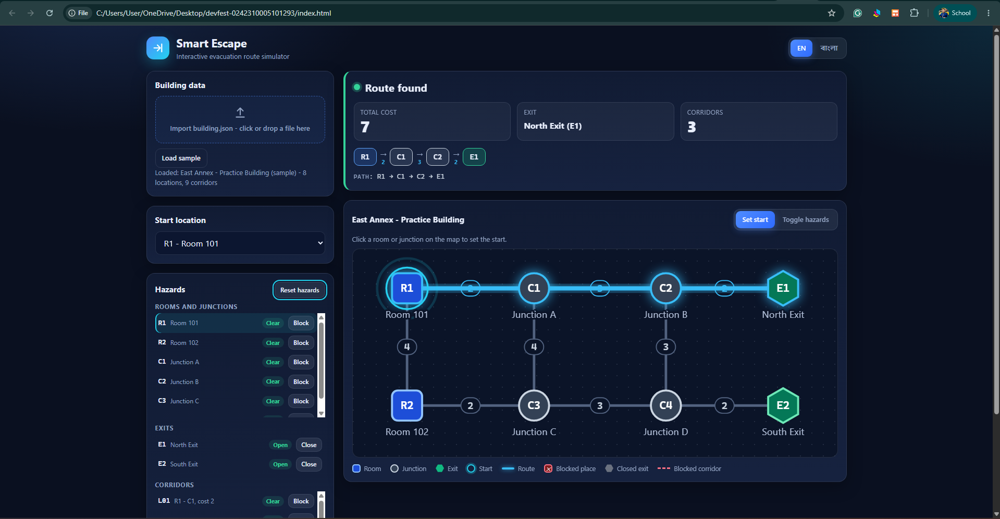
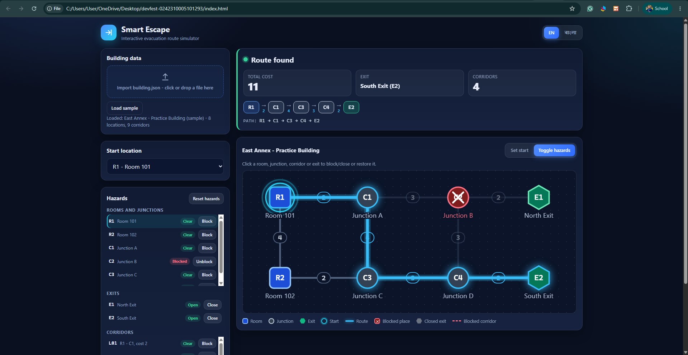

# Smart Escape - Interactive Evacuation Route Simulator

AI DevFest mock test, solo, 90 minutes. A frontend-only web app that shows a building map and finds the lowest-cost route from a chosen start to an open exit, updating instantly as hazards change.

## Identity

- **Name:** Arman Ahmed Miraj
- **Registration number:** 0242310005101293
- **Repository:** https://github.com/ArmanAhmedMiraj/devfest-0242310005101293

## Live website

https://armanahmedmiraj.github.io/devfest-0242310005101293/

(Public GitHub Pages deployment, no login or installation needed. Tested in Chrome.)

## Running locally

No build step and no dependencies.

1. Clone the repository or download it as a ZIP.
2. Open `index.html` in Chrome (double-click works).
3. The sample building loads automatically. Use **Import building.json** (click or drag and drop) to load another file.

Self-tests: open `tests.html` in Chrome. It runs the official sample checks plus tie-break, disconnected-graph and invalid-input cases.

## Screenshots

- `screenshots/01-baseline-r1-to-e1.png` - baseline route R1 - C1 - C2 - E1, cost 7
- `screenshots/02-reroute-c2-blocked.png` - rerouting after C2 is blocked, R1 - C1 - C3 - C4 - E2, cost 11

## Implemented features

- Strict validation of the input file (all rules from section 3.1, clear bilingual error list, previous building kept on failure).
- Map drawn at the supplied coordinates with distinct node types (room, junction, exit), labels and visible corridor costs.
- Start selection from the map or a dropdown (rooms and junctions only).
- Block or unblock rooms and junctions and corridors, and close or reopen exits, from the map or from side lists. Each state looks different (shape and symbol, not only colour).
- Instant recalculation after every start or hazard change, without re-importing. Reset restores the file's original `initial_state`.
- Messages: **No route available** and **Starting location blocked**.
- Bangla and English modes for all principal labels, buttons, statuses, errors and instructions (dataset labels stay unchanged).
- Subtle animations (route drawing, hazard toggles, start pulse) that respect `prefers-reduced-motion`.
- Routing rules: cost is the sum of edge costs. Closed exits and blocked places are never crossed. Ties: smallest exit ID, then lexicographically smallest node-ID sequence (plain string comparison, so `C10` comes before `C2`).
- Keyboard accessible map and controls, with ARIA labels.
- In-browser self-test page (`tests.html`).

## Bonus features

- Keyboard and screen-reader friendly controls.
- Self-test page covering the sample checks and edge cases.
- 3D interface: tilted floor plan, raised blocks, keycap buttons, a 3D high-contrast mode, a rotating daffodil, isometric campus blocks and a partner banner (Daffodil International University, powered by upay). These are original drawings, not official logos.
- Route walkthrough (a dot travels along the found route).
- High-contrast mode (saved in the browser).

## Assumptions

- An exit cannot be selected as a start location.
- Reset restores hazards only. The selected start is kept.
- Duplicate IDs inside the initial-state lists are tolerated.
- Extra unknown fields in the JSON are ignored.
- IDs are case-sensitive.

## Known issues

- Tested only in the latest Chrome.
- Very dense or overlapping coordinates may make labels hard to read.
- No PNG export or progress saving yet.

## AI tools used

Claude (Anthropic) for planning, writing and reviewing the code. Every commit message records the prompt used.

**Most useful prompt:** "Read the problem statement line by line, find the hidden traps (tie-breaking, validation, click-mode conflicts, deployment case-sensitivity) and plan the architecture so the routing logic is a pure tested module and the UI only renders state."

## License

MIT - see `LICENSE`.